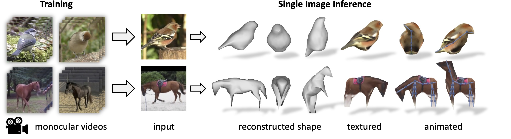

# 🕊 DOVE: Learning Deformable 3D Objects by Watching Videos
#### [Project Page](https://dove3d.github.io/) | [Video](https://youtu.be/WqmNewAQnmY) | [Paper](https://arxiv.org/abs/2107.10844)

In IJCV 2023

[Shangzhe Wu](https://elliottwu.com/)\*, [Tomas Jakab](https://www.robots.ox.ac.uk/~tomj)\*, [Christian Rupprecht](https://chrirupp.github.io/), [Andrea Vedaldi](https://www.robots.ox.ac.uk/~vedaldi) (*equal contribution)

Visual Geometry Group, University of Oxford


***DOVE*** - ***D***eformable ***O***bjects from ***V***id***E***os. Given a collection of video clips of an object category as training data, we learn a model that predicts a textured, articulated 3D mesh from a single image of the object.

## Setup (with [conda](https://docs.conda.io/en/latest/))

### 1. Install dependencies
```
conda env create -f environment.yml
```
or manually:
```
conda install -c conda-forge matplotlib=3.3.1 opencv=3.4.2 scikit-image=0.17.2 pyyaml=5.4.1 tensorboard=2.7.0 trimesh=3.9.35 configargparse=1.2.3 einops=0.3.2 moviepy=1.0.1
```

### 2. Install [PyTorch](https://pytorch.org/)
```
conda install pytorch==1.6.0 torchvision==0.7.0 cudatoolkit=10.1 -c pytorch
```
*Note*: The code is tested with PyTorch 1.6.0 and CUDA 10.1.

### 3. Install [PyTorch3D](https://pytorch3d.org/)
```
conda install -c fvcore -c iopath -c conda-forge fvcore iopath
conda install -c bottler nvidiacub
conda install -c pytorch3d pytorch3d=0.3.0
```
or follow the [instructions](https://github.com/facebookresearch/pytorch3d/blob/main/INSTALL.md).
The code is tested with PyTorch3D 0.3.0.

### 4. Install [LPIPS](https://github.com/richzhang/PerceptualSimilarity) (for computing perceptual loss)
```
pip install lpips
```

## Data
The preprocessed datasets can be downloaded from the scripts in `data/`, including bird videos, horse videos and the 3D toy bird dataset, eg:
```
cd data && sh download_bird_videos.sh
```

The raw captures of the toy birds are also available:
```
cd data && sh download_toy_birds_raw.sh
```

## Pretrained Models
The pretrained models on birds and horses can be downloaded using the scripts in `results/`, eg:
```
cd results/bird && sh download_pretrained_bird.sh
```

## Running
### Training and Testing
Check the configuration files in `configs/` and run experiments, eg:
```
python run.py --config configs/bird/train_bird.yml --gpu 0 --num_workers 4
```

### Evaluation on Birds
#### 1. Mask Reprojection
After generating the results on the bird test set (using `config/bird/test_bird.yml`), check the directories and run:
```
python scripts/eval_mask_reprojection.py
```

#### 2. Toy Bird Scan
After generating the results on the bird test set (using `config/bird/test_bird_toy.yml`), check the directories and run:
```
python scripts/eval_3d_toy_bird.py
```
*Note*: The canonical pose may be facing either towards or away from the camera, as both are valid solutions. The current script assumes the canonical pose is facing away from the camera, hence the line 157 which rotates the mesh 180° to roughly align with the ground-truth scans. You might need to inspect the results and adjust accordiningly.

### Visualization
After generating the test results, check the directories and run:
```
python scripts/render_visual.py
```
There are multiple modes of visualization specified by `render_mode`, including novel views, rotations and animations. Check the script for details.

## Citation
```
@Article{wu2023dove,
    title = {{DOVE}: Learning Deformable 3D Objects by Watching Videos},
    author = {Shangzhe Wu and Tomas Jakab and Christian Rupprecht and Andrea Vedaldi},
    journal = {IJCV},
    year = {2023}
}
```